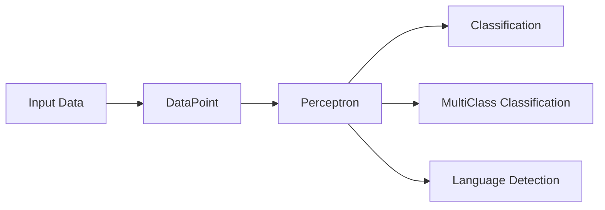

# 🤖 Single Layer Perceptron

## 🎯 About the Project
In this project, I have implemented a single-layer perceptron – a fundamental machine learning algorithm that serves as the foundation of modern neural networks. This project demonstrates my skills in:

- 🧠 Understanding machine learning algorithms  
- 💻 Programming in Java  
- 🏗️ Designing modular architecture  
- 🔍 Solving practical problems  

---

## 🌟 Main Components

📦 **Single Layer Perceptron**
```
 ┣ 📜 Perceptron.java
 ┣ 📜 MultiClassPerceptron.java
 ┣ 📜 DataPoint.java
 ┣ 📜 LanguageClassifier.java
 ┗ 📜 Main.java
```

### 🔹 **Perceptron.java**
✅ Implementation of a classic single-layer perceptron  
✅ Learning algorithm with activation function  
✅ Binary data classification  

### 🔹 **MultiClassPerceptron.java**
✅ Extension for multi-class classification  
✅ Handling complex classification problems  
✅ Adaptive learning mechanism  

### 🔹 **LanguageClassifier.java**
✅ Practical application of the perceptron  
✅ Text classification by language  
✅ Demonstration of real-world algorithm usage  

---

## 💡 Key Features



### 📊 **Binary Classification**
✅ Implementation of a basic perceptron  
✅ Linear data separation  
✅ Adaptive learning process  

### 🎯 **Multi-Class Classification**
✅ Extended perceptron algorithm  
✅ Support for multiple classes  
✅ Advanced decision-making mechanisms  

### 🌍 **Language Classifier**
✅ Practical application of the algorithm  
✅ Text feature analysis  
✅ Language recognition  

---

## 🛠️ Technologies
| **Technology** | **Application** |
|--------------- |-----------------|
| Java ☕       | Programming language |
| Perceptron 🤖 | Machine learning algorithm |
| OOP 🏗️        | Programming paradigm |

---

## 📚 Knowledge Gained

### **Machine Learning Algorithms**
- 📌 Understanding how a perceptron works  
- 📌 Implementing the learning process  
- 📌 Parameter optimization  

### **Software Engineering**
- 📌 Modular design  
- 📌 Readable and maintainable code  
- 📌 SOLID principles  

### **Practical Skills**
- 📌 Data processing  
- 📌 Algorithm implementation  
- 📌 Solving real-world problems  

---

## 🎓 Summary
The **Single Layer Perceptron** project is more than just an algorithm implementation – it showcases my skills in machine learning and programming. It highlights my ability to:

✨ Understand complex algorithmic concepts  
🏗️ Write clean, modular code  
🔍 Implement practical solutions  
📈 Solve real-world problems  

🚀 If you want to see the code in action, feel free to explore the repository! 🔗

